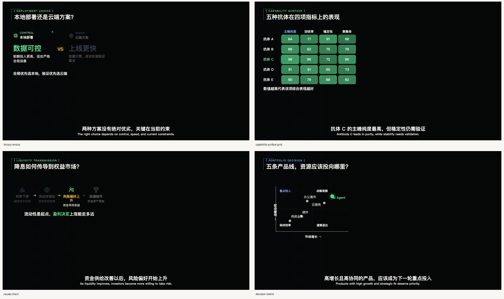
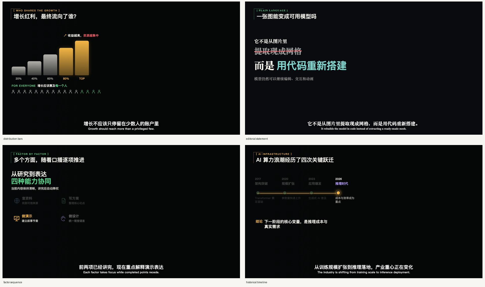
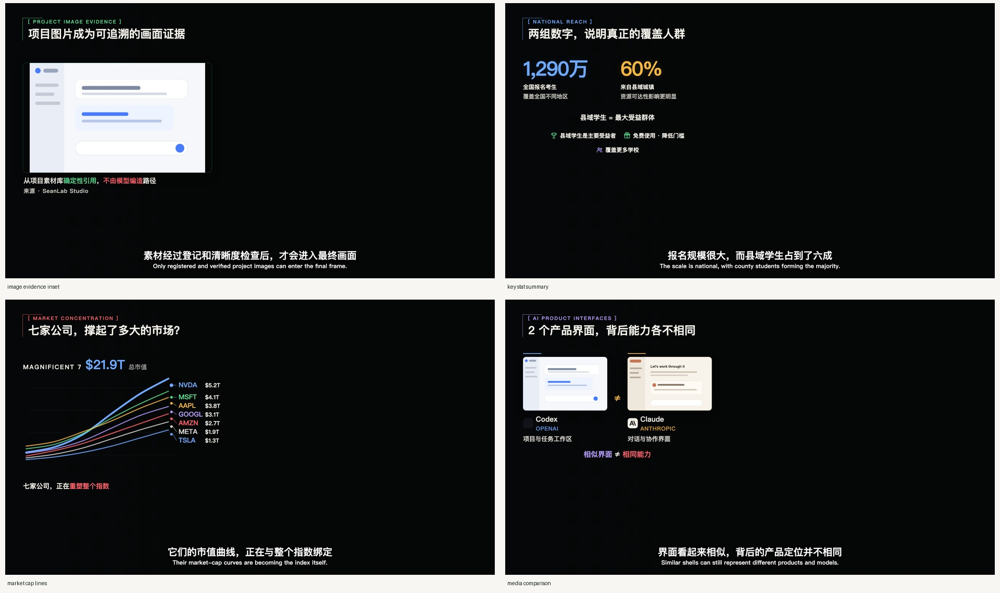
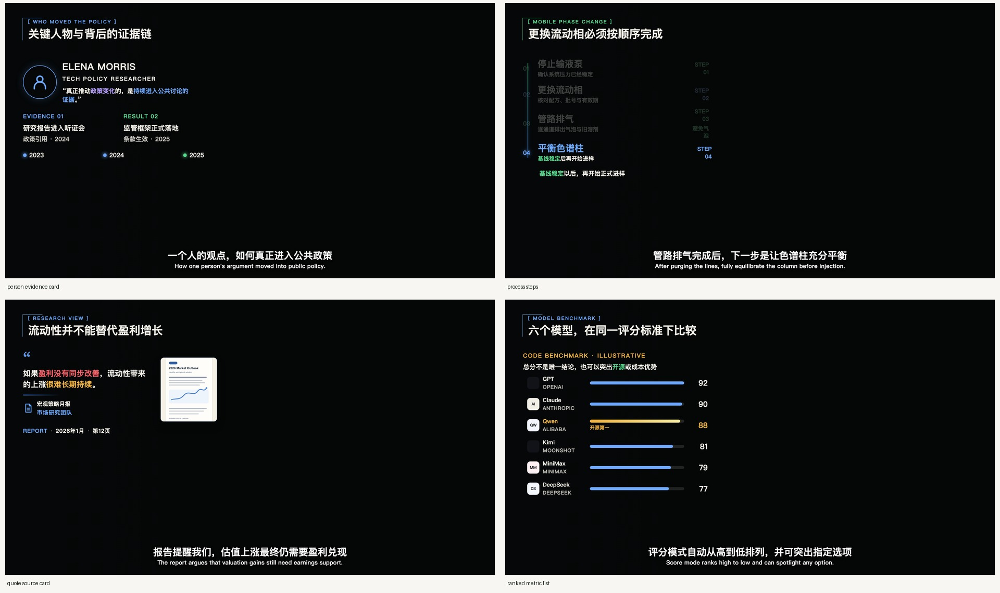
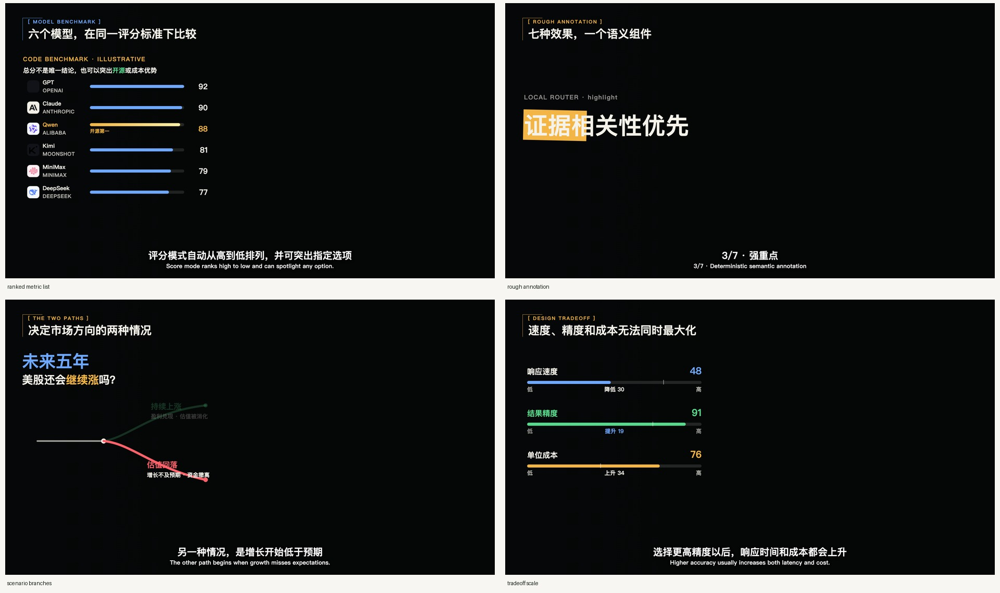
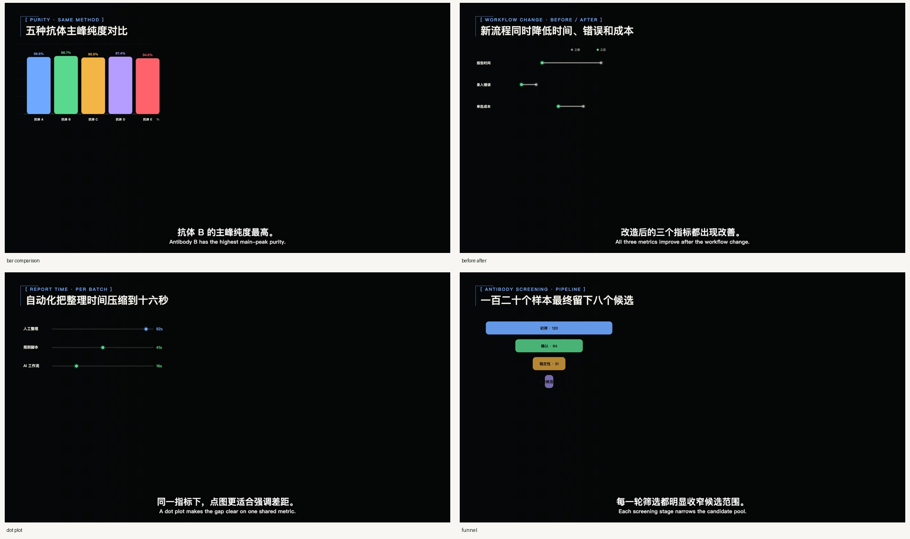
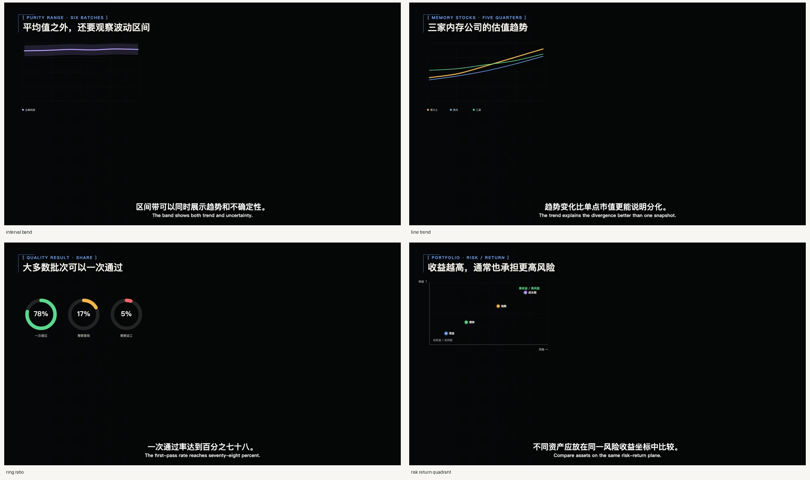
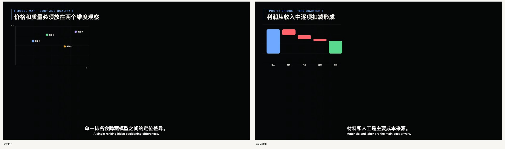

<p align="center">
  
</p>

<h1 align="center">SeanLab Studio</h1>

<p align="center">
  面向知识类口播视频的本地制作 Studio。<br />
  把资料理解、口播稿、粗剪、字幕、视觉规划、人工审核和 Remotion 渲染放进同一条可恢复的工作流。
</p>


## 从原片到成片

SeanLab Studio 将视频制作分成六个清晰阶段：

1. **创建**：确定主题、导入资料，并为项目选择固定的本地 Agent。
2. **写稿**：Agent 理解资料并生成口播稿，创作者修改、审核并锁稿。
3. **拍摄**：导入本地拍摄的口播原片和项目素材。
4. **制作**：完成粗剪、字幕、视觉规划、组件匹配和动画制作。
5. **审核**：通过静态帧和证据记录检查画面，不满意的部分可以定向修改。
6. **交付**：按选定规格渲染成片，完成技术检查后由创作者最终确认。

每个项目都保留自己的进度、素材和审核记录。任务中断后可以从安全阶段继续，不必重跑已经完成的步骤。

## 核心能力

- **Agent 参与制作**：理解资料和口播内容，规划粗剪、字幕与视觉表达，而不是只执行固定模板。
- **可审核的视觉规划**：每个视觉安排都对应具体口播段落，创作者可以在进入渲染前检查和修改。
- **可复用视觉资源库**：内置信息组件、数据图表、图标和动画模板，也支持积累自己的图片素材。
- **保守的口播处理**：保留原意和真实口播，不用字幕改写掩盖错读，也不会自动批准人工审核。
- **可恢复工作流**：保存阶段状态、输入签名和安全恢复点，失败时尽量从最小范围继续。
- **本地优先**：项目文件、原片、截图、字幕和渲染结果保存在本机，不需要托管到云端。

## Studio 与视觉资源库

Studio 集中管理项目进度、固定 Agent、审核节点和可复用视觉素材。


### 19 个信息组件

用于人物与公司证据、关键数字、时间线、流程、因果关系、对比、决策和观点引用等常见表达。组件针对口播视频布局，并为人物画面和字幕保留安全区域。











### 10 种数据图表

覆盖数值对比、时间序列、比例、瀑布变化、散点、区间、漏斗、前后对比和风险收益等场景。







### 统一手绘动画风格

动画默认使用手绘编辑风格。下游 Agent 根据口播语义自主选择流程、因果、状态、分层等信息结构，并可使用本地图标和已绑定的项目图片素材。


- [手绘编辑动画预览](public/assets/animation-templates/paper-editorial-preview-v1.mp4)

## 快速开始

目前版本面向 Apple 芯片 Mac，需要：

- Node.js 22 或更高版本
- FFmpeg 与 ffprobe（支持 H.264/AAC）
- Python 3
- 已登录的 Codex CLI 或 Claude Code（二选一）

```bash
git clone https://github.com/SeanLab612/seanlab-studio.git
cd seanlab-studio
npm ci
npm run setup:python
cp .env.example .env.local
npm run doctor -- --agent codex-cli
npm run studio:start
```

打开 <http://localhost:3080> 开始创建项目。停止服务：

```bash
npm run studio:stop
```

如果使用 Claude Code，将环境检查命令中的 `codex-cli` 改为 `claude-code`。

## 本地数据与隐私

- 真实项目统一保存在 `projects/`，该目录默认不会被 Git 提交。
- 每个项目固定使用一个 Agent，不会在不同服务之间静默切换。
- 封面和视觉素材由用户从本地选择；项目不会自动调用图片生成服务。
- 请勿把真实录音、凭据或私人项目文件加入示例、Issue 或 Pull Request。

## 当前状态

SeanLab Studio 目前是面向开发者和早期用户的本地预览版，尚未打包为可直接安装的桌面应用。工作流、审核节点和渲染链路可以运行，但安装和环境配置仍需要使用命令行。

## 开发与贡献

```bash
npm run format:check
npm run lint
npm run typecheck
npm run test:unit
npm run test:workflow-core
npm run docs:assets
```

提交贡献前请阅读 [CONTRIBUTING.md](CONTRIBUTING.md)、[SECURITY.md](SECURITY.md) 和 [THIRD_PARTY_NOTICES.md](THIRD_PARTY_NOTICES.md)。

## License

SeanLab Studio 原创源代码、界面、功能图标和项目生成的演示素材使用 [MIT License](LICENSE)，可以商用、修改和再分发。

第三方内容不会被重新许可为 MIT：

- Remotion 使用独立的 Remotion License，部分组织或商业用途需要另行取得许可；
- 霞鹜文楷保留 SIL OFL 1.1；
- NASA 回归测试图片仅按 NASA 信息用途规则使用并保留来源；
- Agent 选择器中的 OpenAI 与 Anthropic 官方标识仅用于说明 Codex CLI 和 Claude Code 兼容性，不属于 MIT 素材；
- 产品名称只用于兼容性说明，不代表 OpenAI、Anthropic、NASA 或 Remotion 的合作或背书。

完整边界请查看 [第三方声明](THIRD_PARTY_NOTICES.md)、[素材许可清单](docs/ASSET-LICENSES.md)和[依赖许可清单](docs/DEPENDENCY-LICENSES.md)。用户导入的媒体文件不会因使用本项目而改变授权方式。
