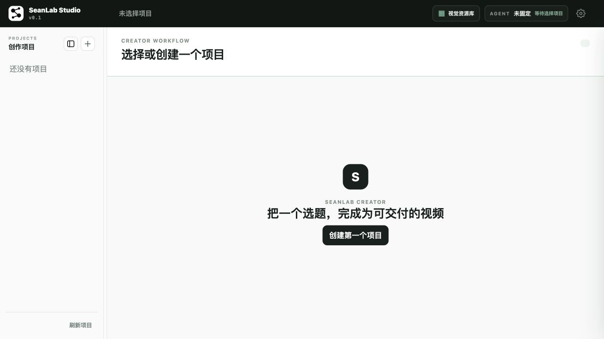
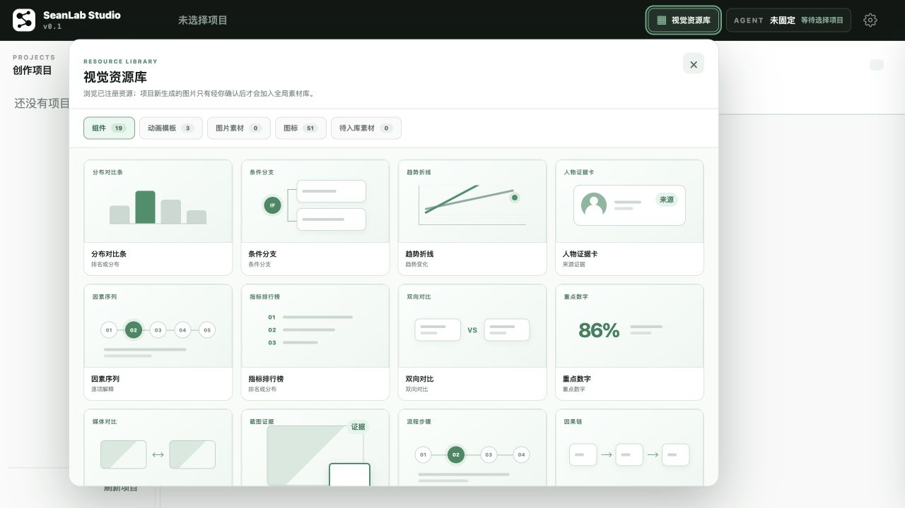
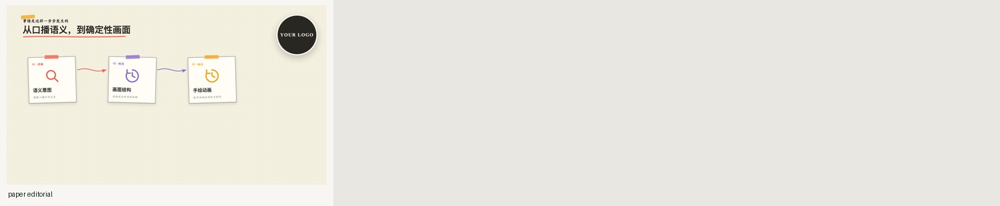

<p align="center">
  
</p>

<h1 align="center">SeanLab Studio</h1>

<p align="center">
  A local-first, agentic production studio for knowledge-driven talking-head videos.<br />
  Script, recut, caption, visually package, self-review, repair, and render in one resumable workflow.
</p>

<p align="center">
  <a href="README.zh-CN.md">简体中文</a> · <strong>English</strong>
</p>

<p align="center">
  <a href="https://github.com/SeanLab612/seanlab-studio/actions/workflows/ci.yml"></a>
  <a href="LICENSE"></a>
  
  
</p>



## What it is

SeanLab Studio is not a generic timeline editor or a one-click text-to-video generator. It is a review-led production workflow where a local coding agent understands source material and narration, edits real footage, plans visual coverage, checks its own work, repairs recoverable failures, and prepares a final Remotion render for the creator to approve.

The creator starts the production, reviews the script, and reviews the finished video. Routine production QA stays inside the agent loop instead of repeatedly stopping the workflow and handing technical errors back to the user.

## From footage to finished video

1. **Create** — choose a topic, import research, and bind one local agent to the project.
2. **Write** — the agent studies the sources and drafts a natural narration; the creator edits, approves, and locks it.
3. **Shoot** — import locally recorded talking-head footage and project assets.
4. **Produce** — the agent handles conservative recutting, captions, visual replanning, component selection, and hand-drawn animation.
5. **Self-review** — the agent checks the cut, keyframes, visual QA evidence, and delivery contract, then repairs recoverable problems and continues.
6. **Approve and render** — the creator reviews the packaged result and renders the approved delivery, using the source resolution and frame rate by default.

Project state, assets, evidence, and approvals remain resumable. Completed stages do not need to be repeated after an interruption.

## Why it is different

- **Agent-directed production** — the agent interprets the material and narration instead of merely filling a fixed template.
- **Downstream visual authority** — early visual direction is advisory. The production agent can redesign coverage around actual speech, available media, and layout constraints. Only assets explicitly marked by the user remain hard requirements.
- **Self-healing workflow** — recoverable semantic, planning, asset, and QA failures are repaired within bounded loops before the creator is asked to intervene.
- **Human approval where it matters** — the creator approves narration and final delivery; the agent never approves creative intent on the creator's behalf.
- **Local-first media handling** — footage, screenshots, captions, project state, and renders stay on the local machine.
- **Reusable visual system** — built-in editorial components, charts, icons, cover backgrounds, and one coherent hand-drawn animation language.

## Quick start

The current preview targets Apple Silicon Macs and requires:

- Node.js 22 or newer
- FFmpeg and ffprobe with H.264/AAC support
- Python 3
- an authenticated Codex CLI or Claude Code installation

```bash
git clone https://github.com/SeanLab612/seanlab-studio.git
cd seanlab-studio
npm ci
npm run setup:python
cp .env.example .env.local
npm run doctor -- --agent codex-cli
npm run studio:start
```

Open <http://localhost:3080>. To stop the persistent Studio service:

```bash
npm run studio:stop
```

For Claude Code, replace `codex-cli` with `claude-code` in the doctor command.

## Visual production library

The Studio includes 19 information components for evidence, key numbers, timelines, processes, causal relationships, comparisons, decisions, and quotations.



It also includes 10 chart patterns for comparisons, time series, proportions, waterfalls, scatter plots, ranges, funnels, before-and-after views, and risk/reward framing.

Animation uses a single hand-drawn editorial language. The production agent selects the information structure and may combine local icons with project-bound images.



- [Watch the hand-drawn animation preview](public/assets/animation-templates/paper-editorial-preview-v1.mp4)

## Local data and privacy

- Real creator projects live under `projects/`, which is excluded from Git by default.
- Each project stays bound to one selected agent; the workflow does not silently switch providers.
- Three neutral cover backgrounds are included. Users provide their own transparent portrait cutout as PNG or WebP.
- The project does not automatically call an image-generation service.
- Never attach recordings, credentials, or private project files to examples, issues, or pull requests.

## Current status

SeanLab Studio is a developer preview, not yet a packaged desktop application. The end-to-end workflow, approval boundaries, recovery path, and rendering pipeline are operational, but installation still requires the command line and the current release is limited to Apple Silicon Macs.

## Development

```bash
npm run format:check
npm run lint
npm run typecheck
npm run test:unit
npm run test:workflow-core
npm run docs:assets
```

Before contributing, read [CONTRIBUTING.md](CONTRIBUTING.md), [SECURITY.md](SECURITY.md), and [THIRD_PARTY_NOTICES.md](THIRD_PARTY_NOTICES.md).

## License

Original SeanLab Studio source code, interface code, functional icons, and generated demo assets are available under the [MIT License](LICENSE).

Third-party material is not relicensed as MIT. Remotion has its own license and may require a company license for some organizational or commercial uses. Fonts, NASA test imagery, and compatibility logos retain their respective terms. Product names indicate compatibility only and do not imply endorsement by OpenAI, Anthropic, NASA, or Remotion.

See [THIRD_PARTY_NOTICES.md](THIRD_PARTY_NOTICES.md), [asset licenses](docs/ASSET-LICENSES.md), and [dependency licenses](docs/DEPENDENCY-LICENSES.md) for the complete boundaries.
